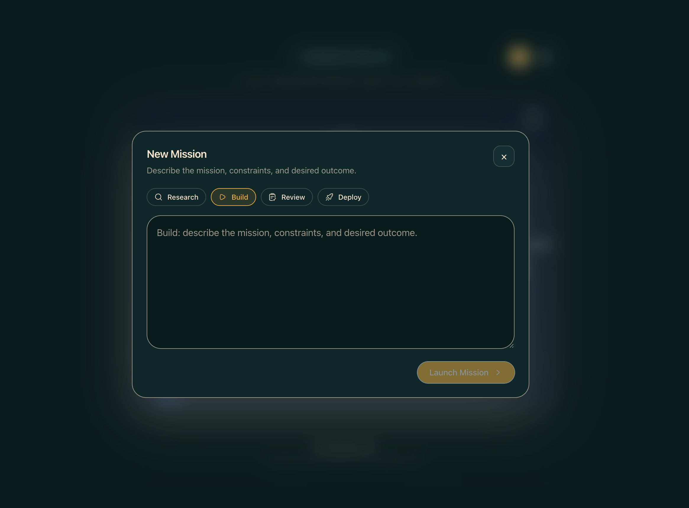
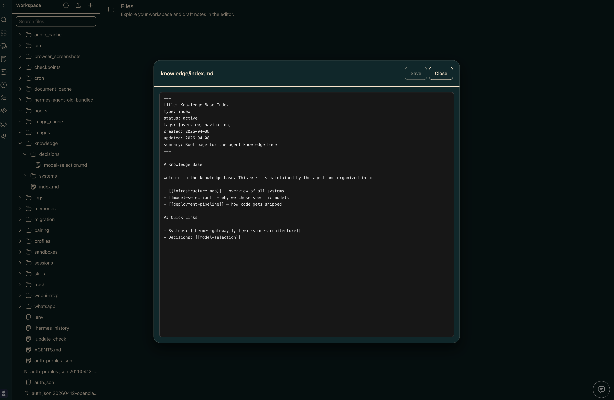
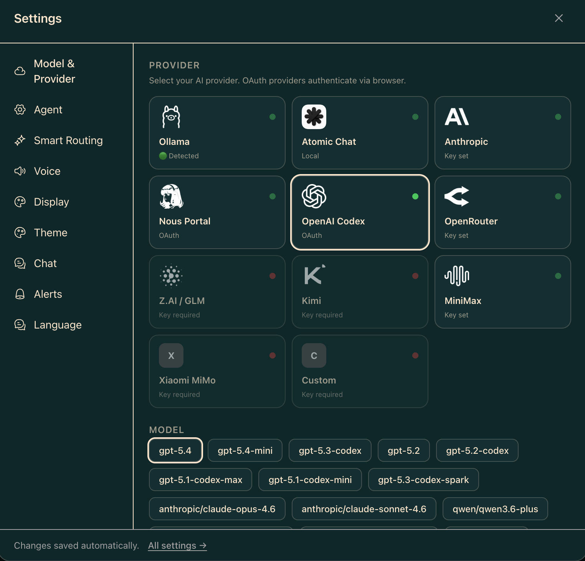
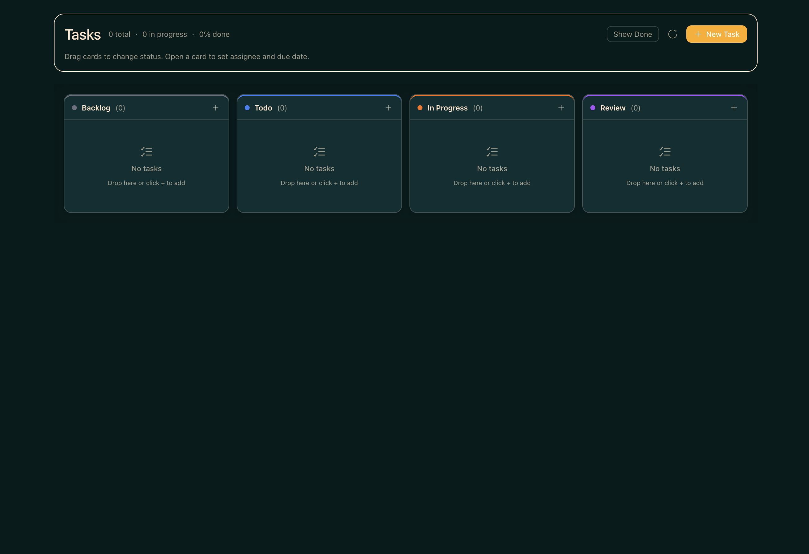
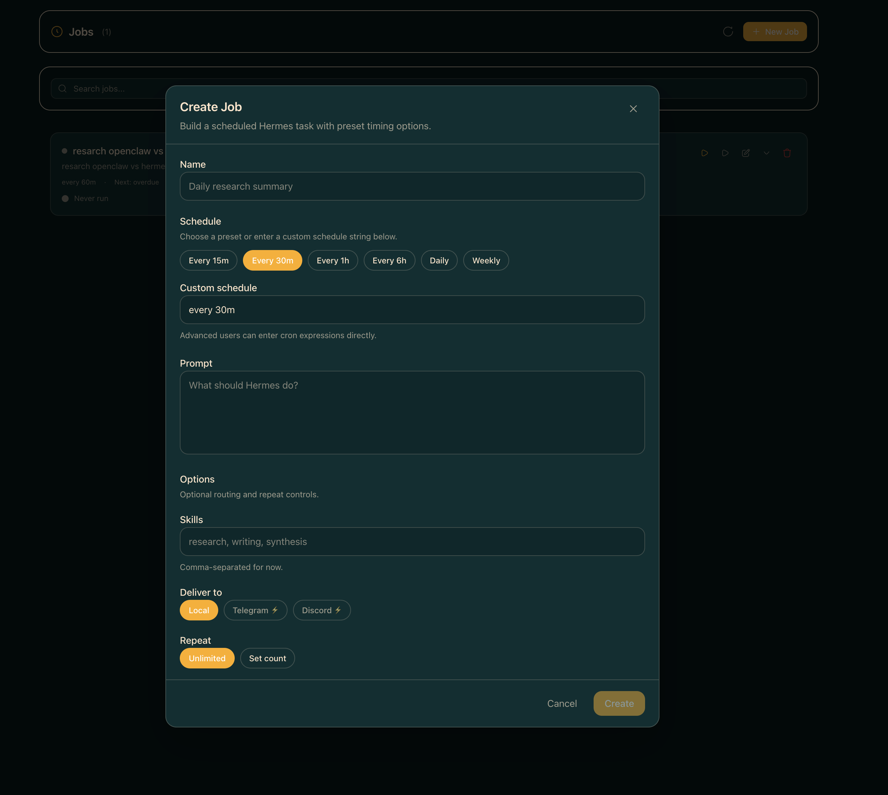

<div align="center">


<!-- имя файла аватара сохранено для стабильности кэша — не переименовывать без скоординированного сброса кэша -->

# Hermes Workspace

**Командный центр вашего ИИ-агента — чат, файлы, память, навыки и терминал в одном месте.**

[](CHANGELOG.md)
[](LICENSE)
[](https://nodejs.org/)
[](CONTRIBUTING.md)

> Не просто оболочка для чата. Это полноценное рабочее пространство — оркеструйте агентов, просматривайте память, управляйте навыками и контролируйте все через единый интерфейс.

> **v2 — zero-fork.** Клонируйте, а не форкайте. Работает на ванильном [`NousResearch/hermes-agent`](https://github.com/NousResearch/hermes-agent), установленном через собственный установщик Nous. Чат, сессии, память, навыки, задачи, MCP, терминал, дашборд, Agent View и Операции полностью соответствуют ванильной версии. **Conductor** в настоящее время требует дополнительного плагина для дашборда, которого еще нет в основной ветке (upstream) — в интерфейсе отображается заглушка, если этот эндпоинт недоступен ([#262](https://github.com/outsourc-e/hermes-workspace/issues/262)). Все остальное работает без патчей.


</div>

---

## Режим Swarm (Рой)

Hermes Agent Swarm превращает рабочее пространство в живой уровень управления: неограниченное количество агентов Hermes, 1 оркестратор и 0 людей для ручного распределения задач.
Постоянные воркеры tmux сохраняют контекст между задачами, безопасно сменяют друг друга и сообщают о контрольных точках с подтверждением выполненной работы.
Диспетчеризация на основе ролей направляет задачи по линиям: разработка, ревью, документация, исследования, операции, триаж, QA и лаборатория, избавляя человека от роли маршрутизатора задач.
Шлюз ревью с проверкой байтов защищает релизные ветки перед отправкой PR.
Автономные линии для PR/issue, лабораторные эксперименты и сценарии исправления ошибок поддерживают работу машины, пока люди принимают ключевые решения.

Начните здесь: [docs/swarm/](./docs/swarm/)

- **Чат Оркестратора** — запросите у центра управления выполнение одной задачи, декомпозированной миссии или полной трансляции.
- **Панель управления мульти-агентами** — просматривайте постоянных агентов Hermes, их роли, состояния, среду выполнения и связи маршрутизации на одной поверхности.
- **Канбан-доска задач** — планируйте этапы: бэклог, готово, в работе, на проверке, заблокировано и выполнено, не покидая рабочего пространства.
- **Отчеты + Входящие** — проверяйте контрольные точки, блокировщики, передачи задач и решения, требующие участия человека.
- **Встроенный TUI View** — подключайтесь к воркерам на базе tmux или переключайтесь на живой поток оболочки/логов.

---

## ✨ Что внутри

- 💬 **Чат** — Потоковая передача SSE в реальном времени, рендеринг вызовов инструментов, поддержка нескольких сессий, markdown + подсветка синтаксиса.
- 🧠 **Память** — Просмотр, поиск и редактирование памяти агента; живой редактор markdown.
- 🧩 **Навыки** — Просмотр более 2000 навыков с метками происхождения, фильтрами, путями к исходникам и маркетплейсом.
- 🔌 **MCP** — Полноценная страница /mcp (каталог + маркетплейс + источники) или локальное управление конфигурациями (CRUD).
- 📁 **Файлы + Терминал** — Полноценный браузер файлов с Monaco; кроссплатформенный PTY-терминал.
- 🎮 **Операции** — Дашборд мульти-агентов с пресетами профилей (Мудрец/Трейдер/Строитель/Писец/Операции) и определением необходимости настройки.
- 📡 **Conductor** — Диспетчеризация и декомпозиция миссий (требуется плагин дашборда, см. [#262](https://github.com/outsourc-e/hermes-workspace/issues/262)).
- 👥 **Agent View** — Живая панель агента в чате с аватаром, очередью, историей и счетчиком использования.
- 🐝 **Режим Swarm** — Постоянные воркеры Hermes Agent на базе tmux с диспетчеризацией по ролям.
- 🗄️ **Дашборд** — Агрегированный обзор: сессии, микс моделей, реестр затрат, карточка внимания, лента операций.
- 🎨 **Темы** — Hermes, Nous, Bronze, Slate, Mono (светлая + темная).
- 🔒 **Безопасность** — Middleware авторизации на каждом маршруте, CSP, защита от обхода путей (path-traversal), безопасная привязка к удаленным адресам.
- 📱 **PWA + Tailscale** — Установка как нативного приложения; доступ с любого устройства в вашей сети Tailscale.
- ⚙️ **Ограничение возможностей** — Функции, требующие внешних эндпоинтов (Conductor), показывают аккуратную заглушку вместо ошибки во время выполнения.

---

## 📸 Скриншоты

|                 Чат                  |                  Conductor                   |
| :----------------------------------: | :------------------------------------------: |
|  |  |

|                   Дашборд                    |                   Память                   |
| :------------------------------------------: | :----------------------------------------: |
|  |  |

|                   Терминал                   |                   Настройки                  |
| :------------------------------------------: | :------------------------------------------: |
|  |  |

|                   Задачи                    |                  Работы                  |
| :-----------------------------------------: | :--------------------------------------: |
|  |  |

---

## 🚀 Быстрый старт

Три пути — выберите подходящий вам:

| Путь | Лучше всего для | Время |
|---|---|---|
| **🐳 [Docker Compose](#-быстрый-старт-через-docker)** | Хостинга на своих мощностях, домашних лабораторий | ~2 мин |
| **🌐 Установка одной командой** | Локальной разработки на macOS/Linux | ~3 мин |
| **🔌 Подключение к существующему `hermes-agent`** | Если у вас уже запущен Hermes Agent | ~1 мин |

### Установка одной командой

```bash
curl -fsSL https://raw.githubusercontent.com/developer3000S/hermes-workspace-rus/main/install.sh | bash
```

Эта команда установит `hermes-agent` через официальный установщик Nous, клонирует этот репозиторий, настроит `.env` и установит зависимости. Затем:

```bash
hermes gateway run                  # терминал 1
cd ~/hermes-workspace && pnpm dev   # терминал 2
```

Откройте http://localhost:3000. Это всё.

---

### Уже запущен `hermes-agent`? Подключите к нему рабочее пространство

Если у вас уже установлен `hermes-agent` (через установщик Nous, из исходников, через systemd, Docker или другую настройку) и он обслуживает шлюз по адресу `http://<host>:8642`, вам не нужно ничего переустанавливать — просто укажите рабочему пространству на него.

```bash
git clone https://github.com/developer3000S/hermes-workspace-rus.git
cd hermes-workspace
pnpm install
cp .env.example .env

# Укажите на существующие сервисы Hermes Agent.
echo 'HERMES_API_URL=http://127.0.0.1:8642' >> .env
# Для установки "zero-fork" также требуется отдельный API дашборда для конфигураций/сессий/навыков/задач.
echo 'HERMES_DASHBOARD_URL=http://127.0.0.1:9119' >> .env

# Если шлюз был запущен с API_SERVER_KEY (авторизация включена), установите то же значение:
# echo 'HERMES_API_TOKEN=***' >> .env

pnpm dev                            # http://localhost:3000 (переопределите через PORT=4000 pnpm dev)
```

Требования со стороны агента:

- Шлюз привязан к адресу, доступному для рабочего пространства (обычно `API_SERVER_HOST=0.0.0.0` + открытый порт).
- `API_SERVER_ENABLED=true` в `~/.hermes/.env` (или в окружении агента), чтобы шлюз обслуживал основные API на порту `:8642`.
- `hermes dashboard` запущен (по умолчанию `http://127.0.0.1:9119`) для установки "zero-fork". Дашборд предоставляет API для конфигураций, сессий, навыков и задач.
- Если установлен `API_SERVER_KEY`, рабочее пространство должно передавать то же значение через `HERMES_API_TOKEN` — в противном случае оставьте оба параметра пустыми.

Проверьте оба сервиса перед открытием рабочего пространства:

- `curl http://127.0.0.1:8642/health` должен вернуть ok.
- `curl http://127.0.0.1:9119/api/status` должен вернуть метаданные дашборда.

Затем запустите рабочее пространство и завершите настройку — оно должно автоматически обнаружить пару шлюз + дашборд и разблокировать расширенные панели.

#### Запуск на удаленном хосте (Tailscale / VPN / LAN)

Если рабочее пространство и браузер находятся на разных машинах — например, рабочее пространство работает на Pi/Mac/домашнем сервере, а вы заходите в него с телефона через Tailscale — укажите в `HERMES_API_URL` **доступный** адрес бэкенда, а не `127.0.0.1`:

```bash
# На сервере, где запущено рабочее пространство + шлюз:
echo 'HERMES_API_URL=http://100.x.y.z:8642' >> .env
echo 'HERMES_DASHBOARD_URL=http://100.x.y.z:9119' >> .env

# Также скажите шлюзу слушать все интерфейсы, чтобы узлы Tailscale могли до него достучаться.
# В ~/.hermes/.env (или там, где шлюз читает конфиг):
echo 'API_SERVER_HOST=0.0.0.0' >> ~/.hermes/.env
```

Затем перезапустите шлюз, дашборд и рабочее пространство. Зайдите в рабочее пространство с удаленного устройства, и проверка соединения будет использовать IP Tailscale вместо localhost. Оба параметра `HERMES_API_URL` и `HERMES_DASHBOARD_URL` должны быть установлены на URL-адреса, доступные через Tailscale/LAN — установка только одного из них оставит другой пытаться подключиться к `127.0.0.1`, что приведет к ошибке.

**Если вы уже запустили рабочее пространство**, вы можете обновить оба URL в разделе `Settings → Connection` без перезапуска. Значения сохраняются в `~/.hermes/workspace-overrides.json` и вступают в силу немедленно (возможности шлюза перепроверяются при сохранении). Редактирование `.env` по-прежнему работает для предпусковой настройки и для CI/контейнеров.

---

### Ручная установка

Hermes Workspace работает с любым OpenAI-совместимым бэкендом. Если ваш бэкенд также предоставляет API шлюза Hermes Agent, расширенные функции, такие как сессии, память, навыки и задачи, разблокируются автоматически.

#### Предварительные требования

- **Node.js 22+** — [nodejs.org](https://nodejs.org/)
- **OpenAI-совместимый бэкенд** — локальный, на своем хостинге или удаленный
- **Опционально:** Python 3.11+, если вы хотите запустить шлюз Hermes Agent локально

#### Шаг 1: Запустите бэкенд

Укажите в Hermes Workspace любой бэкенд, который поддерживает:

- `POST /v1/chat/completions`
- Рекомендуется `GET /v1/models`

Пример настройки шлюза Hermes Agent (с нуля):

```bash
# Установите hermes-agent через официальный установщик Nous
curl -fsSL https://raw.githubusercontent.com/NousResearch/hermes-agent/main/scripts/install.sh | bash

# Настройте провайдера + запустите шлюз
hermes setup
hermes gateway run
```

Наш установщик (выше) выполняет оба шага автоматически. Если вы используете другой OpenAI-совместимый сервер, просто запишите его базовый URL.

### Шаг 2: Установите и запустите Hermes Workspace

```bash
# В новом терминале
git clone https://github.com/developer3000S/hermes-workspace-rus.git
cd hermes-workspace
pnpm install
cp .env.example .env
printf '\nHERMES_API_URL=http://127.0.0.1:8642\n' >> .env
pnpm dev                   # Запускается на http://localhost:3000
```

> **Проверка:** Откройте `http://localhost:3000` и завершите процесс настройки. Сначала подключите бэкенд, затем убедитесь, что чат работает. Если ваш шлюз предоставляет API Hermes Agent, расширенные функции появятся автоматически.

#### Переменные окружения

```env
# URL OpenAI-совместимого бэкенда
HERMES_API_URL=http://127.0.0.1:8642

# Опционально: ключи провайдеров, которые шлюз Hermes Agent может читать во время выполнения.
# Вам нужны только ключи для тех провайдеров, которых вы фактически используете.
# ANTHROPIC_API_KEY=***         # Anthropic
# OPENAI_API_KEY=sk-...                # GPT / o-серии
# OPENROUTER_API_KEY=sk-or-v1-...      # OpenRouter (вкл. бесплатные модели)
# GOOGLE_API_KEY=AIza...               # Gemini
# (Ollama / LM Studio / локальные серверы не требуют ключа)

# Опционально: защита паролем веб-интерфейса
# HERMES_PASSWORD=ваш_пароль
```

---

## 🧠 Локальные модели (Ollama, Atomic Chat, LM Studio, vLLM)

Hermes Workspace поддерживает два режима работы с локальными моделями:

### Переносимый режим (Самый простой)

Направьте рабочее пространство напрямую на ваш локальный сервер — шлюз Hermes Agent не требуется.

### Atomic Chat

```bash
# Запуск рабочего пространства, направленного на Atomic Chat
HERMES_API_URL=http://127.0.0.1:1337/v1 pnpm dev
```

Скачайте [Atomic Chat](https://atomic.chat/), запустите настольное приложение и убедитесь, что модель загружена перед запуском Hermes Workspace.

### Ollama

```bash
# Запуск Ollama
OLLAMA_ORIGINS=* ollama serve

# Запуск рабочего пространства, направленного на Ollama
HERMES_API_URL=http://127.0.0.1:11434 pnpm dev
```

Чат заработает сразу. Сессии, память и навыки будут показывать "Недоступно" (Not Available) — это ожидаемо в переносимом режиме.

### Расширенный режим (Полный набор функций)

Маршрутизация через шлюз Hermes Agent для доступа к сессиям, памяти, навыкам, задачам и инструментам.

Вот два примера `~/.hermes/config.yaml` для локальных провайдеров, которые мы поддерживаем напрямую в рабочем пространстве:

**Atomic Chat**

```yaml
provider: atomic-chat
model: имя-вашей-модели
custom_providers:
  - name: atomic-chat
    base_url: http://127.0.0.1:1337/v1
    api_key: atomic-chat
    api_mode: chat_completions
```

**Ollama**

```yaml
provider: ollama
model: qwen3:32b
custom_providers:
  - name: ollama
    base_url: http://127.0.0.1:11434/v1
    api_key: ollama
    api_mode: chat_completions
```

Вы можете адаптировать эту структуру для других OpenAI-совместимых локальных раннеров, но `Atomic Chat` и `Ollama` — это два встроенных локальных пути, описанных в интерфейсе рабочего пространства.

**2. Включите API сервер в `~/.hermes/.env`:**

```env
API_SERVER_ENABLED=true
```

**3. Запустите шлюз, дашборд и рабочее пространство:**

```bash
hermes gateway run          # Запускает основные API на :8642
hermes dashboard            # Запускает API дашборда на :9119
HERMES_API_URL=http://127.0.0.1:8642 \
HERMES_DASHBOARD_URL=http://127.0.0.1:9119 \
pnpm dev
```

Для шлюзов с авторизацией также установите `HERMES_API_TOKEN` в окружении рабочего пространства равным значению `API_SERVER_KEY`.

Все функции рабочего пространства разблокируются автоматически, как только оба сервиса станут доступны — сессии будут сохраняться, память — записываться между чатами, навыки станут доступны, а дашборд покажет реальные данные об использовании.

> **Работает с любым OpenAI-совместимым сервером** — Atomic Chat, Ollama, LM Studio, vLLM, llama.cpp, LocalAI и др. Просто измените `base_url` и `model` в конфигурации выше.

---

## 🤝 Сопряжение Агента с Рабочим пространством

Рабочее пространство (Workspace) — это интерфейс. **Hermes Agent** — это мозг. Они общаются через два HTTP-сервиса на localhost (или в любой доступной сети).

```
┌─────────────────────────┐         :8642 gateway          ┌───────────────────────┐
│   Рабочее пространство   │ ─────────────────────▶ │      Hermes Agent     │
│       :3000 (UI)        │ ◀───────────────────── │       CLI / мозг      │
└─────────────────────────┘         :9119 dashboard        └───────────────────────┘
```

### Два сервиса, три команды

```bash
hermes gateway run     # терминал 1 · :8642 · чат, модели, потоковая передача, задачи
hermes dashboard       # терминал 2 · :9119 · сессии, навыки, конфиг, MCP
cd ~/hermes-workspace && pnpm dev   # терминал 3 · :3000 · интерфейс (UI)
```

> **Совет:** `pnpm start:all` запускает шлюз + дашборд + рабочее пространство одной командой, если вы устанавливали через скрипт.

### Проверка сопряжения

```bash
curl http://127.0.0.1:8642/health        # → {"status":"ok","platform":"hermes-agent"}
curl http://127.0.0.1:9119/api/status    # → {"status":"ok", ...}
```

Оба запроса должны вернуть `200`. Если какой-то из них не сработает, рабочее пространство перейдет в **переносимый режим** (чат работает, сессии/навыки/память показывают "Недоступно").

### Настройки `.env`, важные для рабочего пространства

```env
# Обязательно: где находится шлюз
HERMES_API_URL=http://127.0.0.1:8642

# Рекомендуется: где находится дашборд (разблокирует сессии/навыки/конфиг/MCP/задачи)
HERMES_DASHBOARD_URL=http://127.0.0.1:9119

# Только если ваш шлюз был запущен с API_SERVER_KEY=... — вставьте то же значение:
# HERMES_API_TOKEN=***

# Опционально: защита паролем самого веб-интерфейса
# HERMES_PASSWORD=***
```

### Распространенные сценарии сопряжения

| Сценарий | Что установить |
|---|---|
| Workspace + шлюз на одной машине | `HERMES_API_URL=http://127.0.0.1:8642`, `HERMES_DASHBOARD_URL=http://127.0.0.1:9119` |
| Шлюз на удаленном сервере (Tailscale / VPN) | Установите оба URL на доступный IP (например, `http://100.x.y.z:8642`) и добавьте `API_SERVER_HOST=0.0.0.0` в `~/.hermes/.env` шлюза |
| Уже запущенный `hermes-agent` из официального установщика | Просто установите `HERMES_API_URL` + `HERMES_DASHBOARD_URL` и пропустите установку скриптом |
| Несколько профилей агентов | Профили находятся в `~/.hermes/profiles/<name>` — дашборд переключается между ними на лету; рабочее пространство следует автоматически |

### Живое пересопряжение (без перезапуска)

Если вы уже запустили рабочее пространство, измените любой из URL-адресов в **Settings → Connection** без перезапуска. Значения сохраняются в `~/.hermes/workspace-overrides.json`, и возможности шлюза перепроверяются при сохранении.

### Устранение неполадок

- **`Could not reach Hermes gateway on 8645, 8642, or 8643`** — шлюз не запущен или `HERMES_API_URL` указывает на недоступный адрес. Запустите `hermes gateway run` и проверьте еще раз.
- **Workspace показывает "portable mode" / отсутствуют расширенные API** — дашборд не запущен. Запустите `hermes dashboard` в другом терминале и обновите страницу.
- **`Unauthorized` при каждом вызове API** — на шлюзе установлен `API_SERVER_KEY`, но в рабочем пространстве отсутствует `HERMES_API_TOKEN`. Они должны совпадать.
- **`Could not connect` с телефона через Tailscale** — шлюз привязан к локальному адресу (loopback). Установите `API_SERVER_HOST=0.0.0.0` в `~/.hermes/.env` и перезапустите его.

---

## 🐳 Быстрый старт через Docker

[](https://github.com/codespaces/new?hide_repo_select=true&ref=main&repo=developer3000S/hermes-workspace-rus)

Настройка Docker запускает **шлюз Hermes Agent** и **Hermes Workspace** вместе.

### Предварительные требования

- **Docker**
- **Docker Compose**
- **Ключ API Anthropic** — [Получить здесь](https://console.anthropic.com/settings/keys) (требуется для шлюза агента)

### Шаг 1: Настройка окружения

```bash
git clone https://github.com/developer3000S/hermes-workspace-rus.git
cd hermes-workspace
cp .env.example .env
```

Отредактируйте `.env` и добавьте **хотя бы один** ключ провайдера LLM — того, которого вы хотите использовать в hermes-agent:

```env
# Выберите один (или несколько). Вам НЕ нужны все сразу.
# ANTHROPIC_API_KEY=***         # Anthropic
# OPENAI_API_KEY=sk-...                # GPT / o-серии
# OPENROUTER_API_KEY=sk-or-v1-...      # OpenRouter (доступны бесплатные модели)
# GOOGLE_API_KEY=AIza...               # Gemini
```

Используете **Ollama, LM Studio или другой локальный сервер**? Ключ не нужен — просто укажите hermes-agent ваш локальный эндпоинт в процессе настройки.

> **Внимание:** `hermes-agent` должен иметь доступ к какой-либо модели. Если вы не настроите ни одного провайдера (ключ API или локальный сервер), чат выдаст ошибку при первом сообщении.

### Шаг 2: Запуск сервисов

```bash
docker compose up
```

Это скачает два предсборных образа и запустит их:

- **hermes-agent** → `nousresearch/hermes-agent:latest` на порту **8642**
- **hermes-workspace** → `ghcr.io/outsourc-e/hermes-workspace:latest` на порту **3000**

Локальная сборка не требуется. Первый запуск займет около минуты для скачивания образов; последующие запуски будут мгновенными. Состояние агента (конфиг, сессии, навыки, память, учетные данные) сохраняется в Docker-томе с историческим названием `claude-data`, поэтому контейнеры можно пересоздавать без потери данных.

### Шаг 3: Доступ к рабочему пространству

Откройте `http://localhost:3000` и завершите настройку.

> **Проверка:** Проверьте логи Docker на наличие строки `[gateway] Connected to Hermes Agent` — это подтверждает, что рабочее пространство успешно подключилось к агенту.

### Сборка из исходников

Хотите вносить изменения в рабочее пространство и видеть их сразу в контейнере? Используйте overlay для разработки:

```bash
docker compose -f docker-compose.yml -f docker-compose.dev.yml up --build
```

Базовый `docker-compose.yml` останется нетронутым — overlay добавляет блок `build:` для сервиса `hermes-workspace`, чтобы компилировался локальный репозиторий вместо скачивания образа. Сервис Hermes Agent по-прежнему использует канонический образ `nousresearch/hermes-agent:latest`; если вам нужна кастомная сборка агента, пометьте её тегом локально и переопределите `image:` в вашем собственном `compose.override.yml`.

### Использование готового образа (Coolify / Easypanel / Dokploy / Unraid)

Разворачиваете Hermes Workspace на PaaS или в домашней лаборатории? Тяните образ напрямую из GitHub Container Registry:

```
ghcr.io/outsourc-e/hermes-workspace:latest
```

Доступные теги:

| Тег | Что это |
|---|---|
| `latest` | Последний коммит в ветку `main` (стабильно; рекомендуется) |
| `v2.0.0` | Закрепленный тег версии semver |
| `main-<sha>` | Конкретный коммит |

Минимальная конфигурация Coolify / Easypanel:

```yaml
service: hermes-workspace
image: ghcr.io/outsourc-e/hermes-workspace:latest
port: 3000
env:
  HERMES_API_URL: http://hermes-agent:8642   # укажите на ваш шлюз
  HERMES_API_TOKEN: ${API_SERVER_KEY}        # если включена авторизация на шлюзе
```

Образ собран для архитектур `linux/amd64` и `linux/arm64`. Используйте его в паре с контейнером `nousresearch/hermes-agent:latest` (как делает наш `docker-compose.yml` по умолчанию) или с существующим шлюзом на другом хосте.

---

## 📱 Установка как приложение (Рекомендуется)

Hermes Workspace — это **Progressive Web App (PWA)**. Установите его, чтобы получить полноценный опыт нативного приложения: без интерфейса браузера, с поддержкой горячих клавиш и автономным режимом.

### 🖥️ Десктоп (macOS / Windows / Linux)

1. Откройте Hermes Workspace в **Chrome** или **Edge** по адресу `http://localhost:3000`.
2. Нажмите **иконку установки** (⊕) в адресной строке.
3. Нажмите **Установить** — Hermes Workspace откроется как отдельное настольное приложение.
4. Закрепите в Dock / на панели задач для быстрого доступа.

> **Для пользователей macOS:** После установки вы также можете добавить приложение в Launchpad.

### 📱 iPhone / iPad (iOS Safari)

1. Откройте Hermes Workspace в **Safari** на вашем iPhone.
2. Нажмите кнопку **Поделиться** (□↑).
3. Прокрутите вниз и нажмите **"На экран «Домой»"**.
4. Нажмите **Добавить** — иконка Hermes Workspace появится на вашем домашнем экране.
5. Запускайте с домашнего экрана для полноценного использования.

### 🤖 Android

1. Откройте Hermes Workspace в **Chrome** на вашем устройстве Android.
2. Нажмите **меню из трех точек** (⋮) → **"Установить приложение"** (или "Добавить на главный экран").
3. Нажмите **Добавить/Установить** — теперь Hermes Workspace работает как нативное приложение.

---

## 📡 Мобильный доступ через Tailscale

Получайте доступ к Hermes Workspace из любого места — без проброса портов и сложностей с VPN.

### Настройка

1. **Установите Tailscale** на ваш компьютер и мобильное устройство:
   - Компьютер: [tailscale.com/download](https://tailscale.com/download)
   - iPhone/Android: Ищите "Tailscale" в App Store / Play Store.

2. **Войдите** в один и тот же аккаунт Tailscale на обоих устройствах.

3. **Найдите IP-адрес вашего компьютера в Tailscale:**

   ```bash
   tailscale ip -4
   # Пример вывода: 100.x.x.x
   ```

4. **Откройте Hermes Workspace на телефоне:**

   ```
   http://100.x.x.x:3000
   ```

5. **Добавьте на главный экран**, используя шаги выше, для полноценного опыта.

> 💡 Tailscale работает через любую сеть — домашний Wi-Fi, мобильные данные, даже из других стран. Ваш трафик полностью зашифрован.

---

## 🖥️ Нативное десктопное приложение

> **Статус: В разработке** — Нативное приложение на базе Electron находится в активной стадии разработки.

Нативное приложение предложит:

- Нативное управление окнами и иконку в трее.
- Системные уведомления о событиях агента и завершении миссий.
- Автозапуск при старте системы.
- Глубокую интеграцию с ОС (меню macOS, панель задач Windows).

**А пока:** Установите Hermes Workspace как PWA (см. выше) — это отличный вариант, максимально близкий к нативному.

---

## ☁️ Облачная и хостинговая версия

> **Статус: Скоро**

Разрабатывается полностью управляемая облачная версия Hermes Workspace:

- **Развертывание в один клик** — Хостинг не требуется.
- **Синхронизация между устройствами** — Доступ к агентам с любого устройства.
- **Командная работа** — Общий центр управления миссиями для всей команды.
- **Автоматические обновления** — Всегда последняя версия.

Функции, ожидающие облачную инфраструктуру:

- Синхронизация сессий между устройствами.
- Общая память и рабочие пространства для команд.
- Облачный бэкенд с гарантированным аптаймом.
- Интеграция вебхуков и внешние триггеры.

---

## 🔒 Безопасность и переменные окружения

Основные меры защиты — большинство включены по умолчанию. Переменные ниже нужны для удаленного развертывания или Docker, если вы отказываетесь от привязки только к локальному адресу (loopback).

### Встроенная защита

- Middleware авторизации на каждом API маршруте.
- CSP заголовки через мета-теги.
- Защита от обхода путей (path-traversal) на маршрутах файлов/памяти (проверка реального пути, а не просто префикса строки).
- Ограничение частоты запросов (rate limiting) на эндпоинтах.
- Защита при запуске: отказ в привязке к внешним адресам без установленного `HERMES_PASSWORD`.
- Сессионные куки: `HttpOnly` + `SameSite=Strict` + `Secure` (в продакшене).
- Опциональная защита паролем для веб-интерфейса.

### Переменные окружения для удаленного/Docker развертывания

- `HERMES_PASSWORD` — требуется, когда `HOST ≠ 127.0.0.1` (устаревший `CLAUDE_PASSWORD` всё еще поддерживается для совместимости).
- `COOKIE_SECURE=1` — принудительно устанавливает флаг `Secure` для кук при использовании HTTPS через прокси.
- `COOKIE_SECURE=0` — отключает флаг `Secure` для развертываний в локальной сети по HTTP (`HOST=0.0.0.0` без HTTPS); без этого браузеры могут молча отбрасывать сессионные куки, и вход не сработает (#149).
- `TRUST_PROXY=1` — доверять заголовкам `x-forwarded-for` / `x-real-ip` (устанавливать только за очищающим обратным прокси).
- `HERMES_DASHBOARD_TOKEN` — явный токен Bearer для API дашборда (предпочтительнее устаревшего метода скрапинга HTML).
- `HERMES_API_TOKEN` — токен Bearer для шлюза Hermes Agent, если он запущен с `API_SERVER_KEY` (устаревший `CLAUDE_API_TOKEN` всё еще поддерживается).
- `HERMES_ALLOW_INSECURE_REMOTE=1` — обход защиты при запуске (не рекомендуется).

Полный список см. в `.env.example`. Спасибо [@kiosvantra](https://github.com/kiosvantra) за аудит безопасности и выявление проблем #121–#125.

---

## 🔧 Устранение неполадок

### "Рабочее пространство загружается, но чат не работает"

Рабочее пространство автоматически определяет возможности вашего шлюза при запуске. Проверьте терминал на наличие строк:

```
[gateway] http://127.0.0.1:8642 available: health, models; missing: sessions, skills, memory, config, jobs
[gateway] Missing Hermes Agent APIs detected. Update hermes-agent to the latest version.
```

**Решение:** Обновитесь до последней официальной версии `hermes-agent`, в которой есть расширенные эндпоинты:

```bash
cd ~/hermes-agent && git pull && uv pip install -e .
hermes gateway run
```

(Если вы устанавливали другим способом, следуйте инструкциям по обновлению вашего установщика Nous.) Если вы использовали старый форк `outsourc-e/hermes-agent`, он больше не нужен, начиная с версии v2 — удалите его и используйте основную ветку (upstream).

### "Connection refused" или зависание при загрузке

Шлюз Hermes Agent не запущен. Запустите его:

```bash
hermes gateway run
```

Если это первый запуск, сначала выполните `hermes setup`, чтобы выбрать провайдера и модель.

### Ollama: чат возвращает пустоту или модель "Offline"

Убедитесь, что в вашем `~/.hermes/config.yaml` есть раздел `custom_providers`, а в `~/.hermes/.env` установлено `API_SERVER_ENABLED=true`. См. раздел [Локальные модели](#-локальные-модели-ollama-lm-studio-vllm) выше.

Также убедитесь, что Ollama запущена с разрешенным CORS:

```bash
OLLAMA_ORIGINS=* ollama serve
```

Используйте `http://127.0.0.1:11434/v1` (не `localhost`) в качестве базового URL.

Проверка: `curl http://localhost:8642/health` должен возвращать `{"status": "ok"}`.

### "Использование официального NousResearch/hermes-agent"

Версия v2+ работает на оригинальном `hermes-agent`. **Форк не требуется.** Оригинальный проект содержит все эндпоинты, необходимые рабочему пространству для чата, сессий, памяти, навыков, конфигурации, задач, MCP, терминала и Agent View.

**Одно известное исключение:** **Conductor** использует плагин дашборда, который еще не попал в основную ветку. Когда рабочее пространство обнаруживает отсутствие этого эндпоинта, на экране Conductor отображается заглушка "Upstream not ready" со ссылкой на [issue #262](https://github.com/outsourc-e/hermes-workspace/issues/262) вместо ошибки во время работы. Всё остальное функционирует.

Если вы используете старую версию `hermes-agent`, в которой отсутствуют основные эндпоинты, рабочее пространство корректно перейдет в **переносимый режим** с базовым чатом — обновитесь до актуальной версии, чтобы восстановить все функции.

### Docker: "Unauthorized" или "Connection refused" к hermes-agent

Если вы используете Docker Compose и получаете ошибки авторизации:

1. **Проверьте, установлен ли хотя бы один ключ провайдера:**

   ```bash
   grep -E '_API_KEY' .env
   # Должен быть один из: ANTHROPIC_API_KEY, OPENAI_API_KEY, OPENROUTER_API_KEY, GOOGLE_API_KEY, ...
   ```

   (hermes-agent читает ключ, соответствующий провайдеру, настроенному в `~/.hermes/config.yaml`.)

2. **Посмотрите логи контейнера агента:**

   ```bash
   docker compose logs hermes-agent
   ```

   Ищите ошибки запуска или предупреждения об отсутствии ключей API.

3. **Проверьте доступность агента:**

   ```bash
   curl http://localhost:8642/health
   # Должен вернуть: {"status": "ok"}
   ```

4. **Перезапустите с чистыми контейнерами:**

   ```bash
   docker compose down
   docker compose up --build
   ```

5. **Проверьте логи рабочего пространства на статус шлюза:**
   ```bash
   docker compose logs hermes-workspace
   ```
   Ищите строку: `[gateway] http://hermes-agent:8642 mode=...` — если там `mode=disconnected`, значит агент запущен некорректно.

### Docker: старая документация по `claude webapi` неверна

Команда `claude webapi`, упоминаемая в некоторых старых документах, больше не существует. Правильные команды:

```bash
hermes gateway run    # Шлюз FastAPI на :8642
hermes dashboard      # Плагин дашборда на :9119 (сессии/навыки/задачи/конфиг)
```

Настройка Docker запускает оба сервиса автоматически — никаких дополнительных действий при использовании `docker compose up` не требуется.

---

## 🗺️ Дорожная карта

### Выполнено ✅

| Функция | Что делает |
|---|---|
| Чат + потоковая передача SSE | Живой вывод агента с рендерингом вызовов инструментов |
| Файлы + Терминал | Полноценный браузер файлов + кроссплатформенный PTY |
| Память + Навыки | Редактирование памяти, просмотр более 2000 навыков с маркетплейсом |
| Дашборд | Сессии, микс моделей, реестр затрат, карточка внимания |
| Операции | Управление несколькими агентами с пресетами персонажей |
| Agent View | Живая панель агента в чате |
| Режим Swarm | Постоянный пул воркеров на базе tmux с диспетчеризацией ролей |
| Страница MCP | Полный каталог + маркетплейс + источники |
| Мобильное PWA + Tailscale | Установка как нативного приложения на любое устройство |
| Темы | Hermes / Nous / Bronze / Slate / Mono (светлая + темная) |
| Ограничение возможностей | Аккуратные заглушки для функций, которых еще нет в upstream |
| Мульти-провайдер | Anthropic, OpenAI, OpenRouter, Google, Ollama, LM Studio, vLLM, Atomic Chat |

### В процессе 🔨

| Функция | Статус |
|---|---|
| Миссии Conductor | Интерфейс в Workspace готов; ожидается плагин дашборда в upstream (см. [#262](https://github.com/outsourc-e/hermes-workspace/issues/262)) |
| Нативное десктопное приложение (Electron) | Прописано в спецификациях; установка через PWA работает уже сегодня |

### В планах 🔜

| Функция | Статус |
|---|---|
| Облачная / Хостинговая версия | Ожидает готовности инфраструктуры |
| Командная работа | Ожидает облачную версию + поддержку мультиарендности |

---

## ⭐ История звезд

## [](https://www.star-history.com/#developer3000S/hermes-workspace-rus&type=date&logscale&legend=top-left)

## 💛 Поддержать проект

Hermes Workspace — это свободное программное обеспечение с открытым исходным кодом. Если оно экономит ваше время и помогает в работе, рассмотрите возможность поддержки разработки:

**ETH:** `0xB332D4C60f6FBd94913e3Fd40d77e3FE901FAe22`

[](https://github.com/sponsors/outsourc-e)

Каждый вклад помогает проекту двигаться вперед. Спасибо 🙏

---

## 🤝 Участие в разработке

Мы рады вашим PR! Инструкции см. в [CONTRIBUTING.md](CONTRIBUTING.md).

- Исправление ошибок → создавайте PR напрямую.
- Новые функции → сначала создайте issue для обсуждения.
- Проблемы безопасности → см. [SECURITY.md](SECURITY.md) для ответственного разглашения.

---

## 📄 Лицензия

MIT — подробности см. в файле [LICENSE](LICENSE).

---

<div align="center">
  <sub>Сделано с ⚡ пользователем <a href="https://github.com/outsourc-e">@outsourc-e</a> и сообществом Hermes Workspace</sub>
</div>
# hermes-workspace-rus
